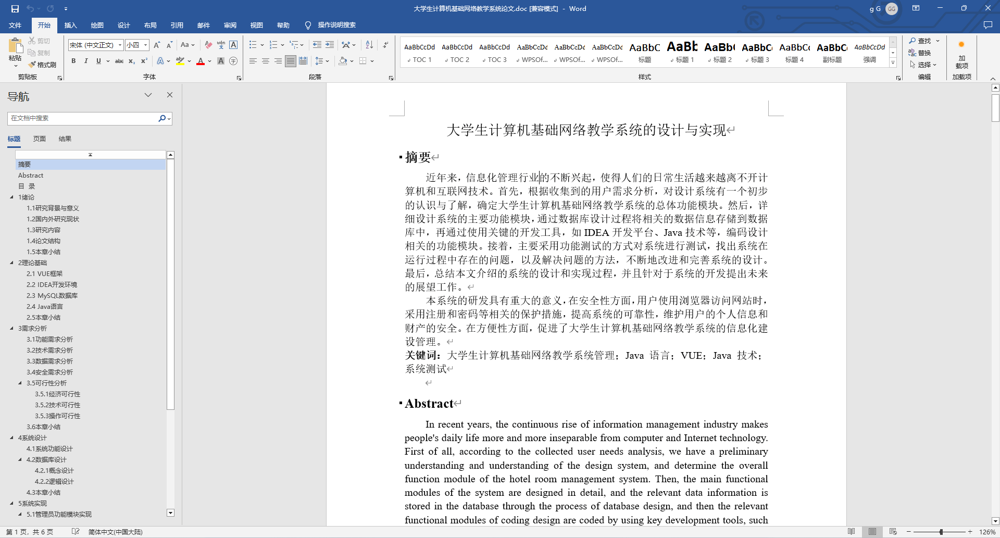
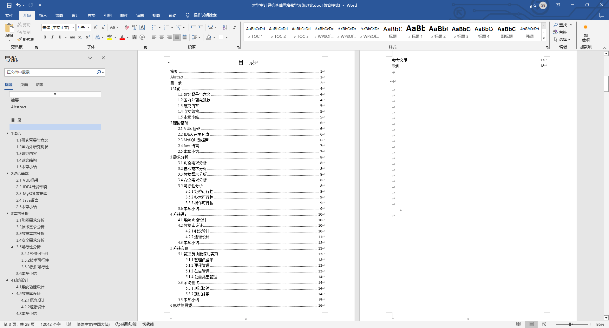
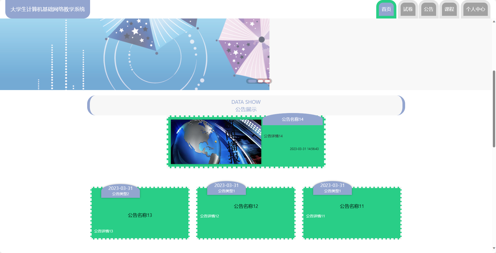
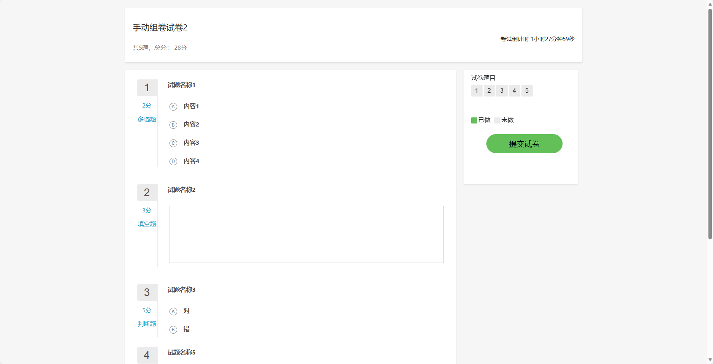
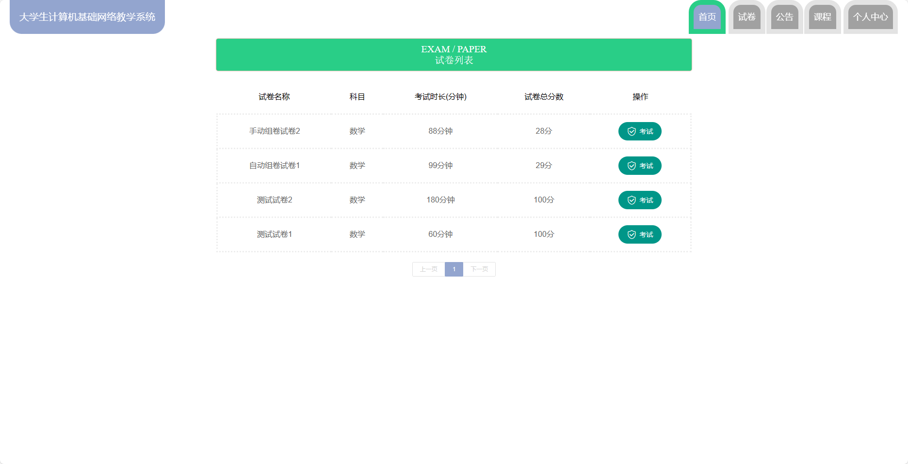
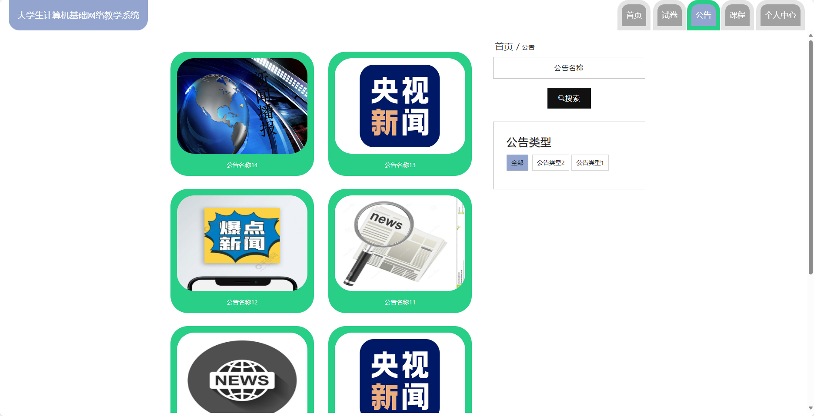
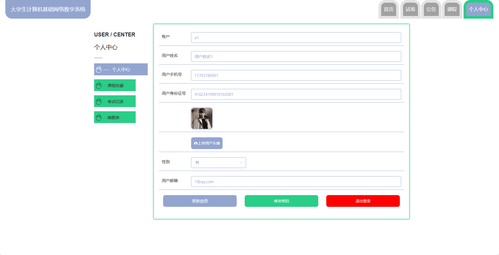
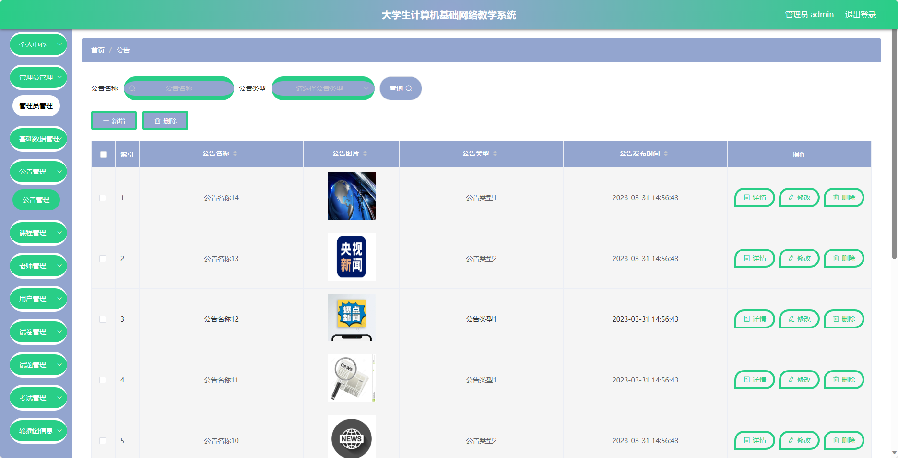
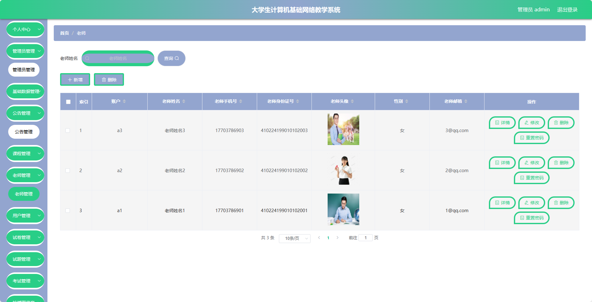
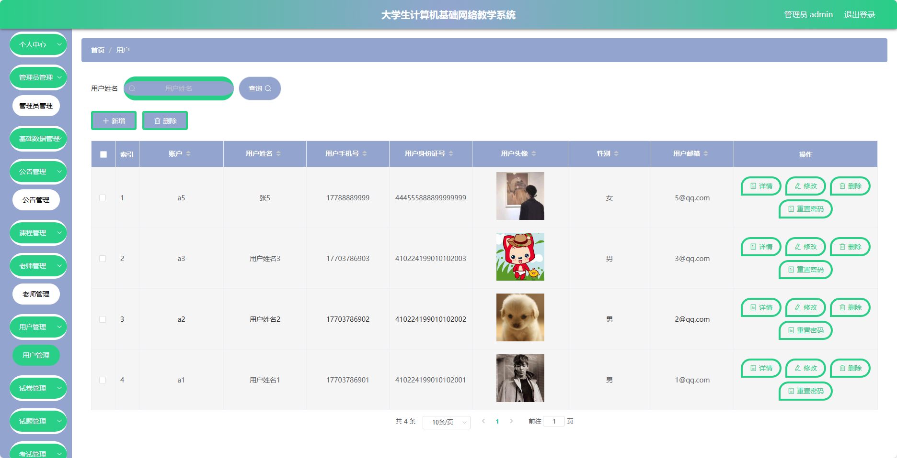

基于SpringBoot的大学生计算机基础网络教学系统（程序+论文）
=
- 完整代码获取地址：从戎源码网 ([https://armycodes.com/](https://armycodes.com/))
- 作者微信：19941326836  QQ：952045282 
- 承接计算机毕业设计、Java毕业设计、Python毕业设计、深度学习、机器学习
- 选题+开题报告+任务书+程序定制+安装调试+论文+答辩ppt 一条龙服务
- 所有选题地址https://github.com/nature924/allProject

一、项目介绍
---
基于Spring Boot框架实现的大学生计算机基础网络教学系统，系统包含三种角色：管理员、老师、用户,系统分为前台和后台两大模块，主要功能如下。

### 前台功能：
- 首页：展示系统的概况、热门课程、公告等信息。
- 试卷：提供学生在线参与测试和练习的功能。
- 公告：发布学校或课程相关的通知和公告。
- 课程：展示各类课程信息，包括课程介绍、教学资料等。
- 个人中心：学生个人信息管理、课程学习记录等。

### 后台功能：
### 管理员：
- 个人中心：管理个人信息和账户。
- 管理员管理：对系统中的管理员账号进行管理和权限设置。
- 基础居管：管理系统的基础设置，如系统参数配置、日志管理等。
- 公告管理：发布和管理系统中的公告信息。
- 课程管理：管理系统中的课程信息，包括新增、编辑、删除等操作。
- 老师管理：管理系统中的教师信息，包括新增、编辑、删除等操作。
- 用户管理：管理系统中的用户信息，包括学生和其他用户的管理。
- 试卷管理：管理系统中的试卷信息，包括新增、编辑、删除等操作。
- 试题管理：对试题库进行管理，包括试题的录入、编辑和删除等操作。
- 考试管理：管理在线考试的安排和监控。
- 轮播图信息：管理系统首页轮播图的内容和链接。

### 老师：
- 个人中心：管理个人信息和账户。
- 公告管理：发布和管理课程相关的通知和公告。
- 课程管理：编辑所负责的课程信息，包括章节设置、资料上传等。
- 用户管理：查看学生信息和学习进度。
- 试卷管理：创建和编辑考试试卷。
- 试题管理：管理个人的试题库，包括试题的录入、编辑和删除等操作。
- 考试管理：安排和监控学生的在线考试。

二、项目技术
---
- 编程语言：Java
- 数据库：MySQL
- 项目管理工具：Maven
- 前端技术：VUE、HTML、Jquery、Bootstrap
- 后端技术：Spring、SpringMVC、MyBatis

三、运行环境
---
- 操作系统：Windows、macOS都可以
- JDK版本：JDK1.8以上都可以
- 开发工具：IDEA、Ecplise、Myecplise都可以
- 数据库: MySQL5.7以上都可以
- Tomcat：任意版本都可以
- Maven：任意版本都可以

四、运行截图
---
### 论文截图：

### 程序截图：

